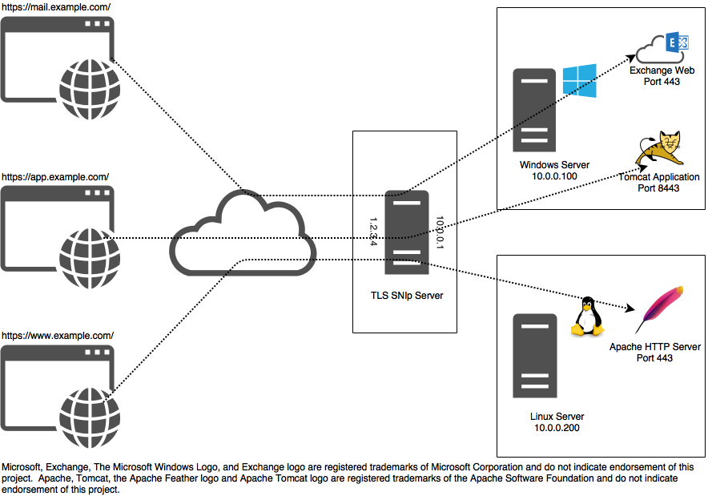

# TLS SNIp - An SNI Based Proxy

## What is TLS?
Transport Layer Security (TLS), known as SSL (Secure Socket Layer) in previous protocol versions, is used to secure 
network communications between two application end-points (generally client and server software).  TLS provides
mechanisms to verify the identity of each endpoint as well as the privacy and integrity of communicated data.  Because 
TLS maintains the semantics of the underlying duplex-stream protocol (TCP in most cases) it is well suited to retro-fit 
existing stream based protocols. For example, Secure HTTP (HTTPS) is the common HTTP Protocol streamed over a TLS
connection.


## What is SNI?
Server Name Indication (SNI) is a TLS extension proposed in RFC 4366 (dated April 2006).  SNI provides for an optional
clear-text indication of the target server's address in the opening phase of communication.  SNI allows TLS servers with 
credentials for multiple identities to select and transmit a client-requested identity instead of blindly providing a 
single identity. As an example, virtual website hosting providers can use an SNI-enabled HTTPS servers to host multiple
secure website certificate identities on the same IP address and port.  Without SNI HTTPS servers can only effectively 
serve one certificate identity per IP address.  In practice this results in wastes IPv4 addresses which have non-trivial
costs and are in short demand. SNI support is commonly enabled in modern web browsers; see below for more details.

## SNI Proxying
In SNI Proxying we use the client's Server Name Indication not to select an identity locally, but instead to select a
target server which can provide that identity.  Once the target has been determined, the proxy server connects and
begins relaying data between the client and target.  The TLS negotiation occurs between the client and target server; 
the proxy relays the handshake and encrypted data, but is not a party to the unencrypted communication.  

## Use Cases

### Mixed Platform HTTPS Hosting
Small and medium businesses are often allocated a single static IPv4 address for on-premise internet connectivity.
TLS SNIp allows these businesses to host multiple HTTPS services on a single IPv4 address.  Communication between 
the client browser and end service application is secured end-to-end.  The end HTTPS applications require no special
configuration and can be hosted on the same server, or traverse the local network.


## Building and Installing TLS SNIp
TLS SNIp uses the cmake build system.  Cmake can generate build projects/scripts for unix make, xcode, and MS Visual
Studio, among others.

### Requirements
- LibEvent 2.1
- LibYAML

## Configuration
TLS SNIp uses [YAML 1.1](http://yaml.org/spec/1.1/) to describe its configuration.  YAML is a superset of JSON, meaning
configurations can also be specified in JSON.  YAML permits comments on lines which start with "#".

### Command Line Arguments

```
   -c FILE, --conf FILE       Specify an alternative config file.
                              Default: snip.yml
   -t, --test-config          Evaluate the config file and then exit. Exit code 0 for success.
   -h, --help                 Display this help message.
```

### Reloading Configuration
Configurations can be reloaded by signaling HUP.  
```
killall -HUP snip
```

To be safe, you should test the configuration before reloading it.  Loading an invalid configuration can cause the
application to exist with an error. 

```
if ./snip -t -c ../example.yml; then killall -HUP snip; fi
```

If the 'user' configuration value is specified, TLS SNIp drops privileges after it binds to ports during launch. 
Privileges cannot be regained after they have been dropped.  Adding an additional privileged listener and reloading,
will cause a fatal error when SNIp tries to bind the port with its reduced privileges.  

### Configuration File
* "**listeners**" (**Required**) *List* - A list of listener objects, specified in the format listed below.
* "**routes**" *(Optional) List|Dictionary* - A list of route objects, specified in the format listed below.
* "**disable_ipv4**" *(Optional) Boolean* - Don't use IPv4 for outbound connections and don't bind IPv4 listeners for wildcard
 'bind's. It is invalid to specify both ""
 *Note: explicitly ipv6 listeners (ex. "[::]:443") will still bind.*
* "**disable_ipv6**" *(Optional) Boolean* - Don't use IPv4 for outbound connections and don't bind IPv4 listeners for wildcard
 'bind's.  
 *Note: explicitly ipv4 listeners (ex. "0.0.0.0:443") will still bind.*
* "**user**" *(Optional, required if "group" is specified) String* - After binding the listeners, drop privileges and switch to the specified user.
* "**group**" *(Optional) String* - After binding the listeners, drop privileges and switch to the specified group.

#### Listeners
Listeners describe a configuration for a specific port which TLS SNIp will proxy. The configuration must specify at 
least one listener.
* "**bind**" (**Required**) *String|Number* - A port and optional address TLS SNIp should listen on.  
 The following formats are valid
  * "port" or "*:port" (ex. "443" or "*:443") - TLS SNIp will listen at the specified port on all IPv4 and IPv6 sockets
    unless "disable_ipv4" or "disable_ipv6" are specified.
  * "0.0.0.0:port" (ex. "0.0.0.0:443") - TLS SNIp will listen at the specified port on all IPv4 sockets.
  * "[::]:port" (ex. "[::]:443") - TLS SNIp will listen at the specified port on all IPv6 sockets.
  * "IPv4:port" (ex. "10.0.0.1:443") - TLS SNIp will listen at the specified port on the interface which has the 
    specified address.
  * "[IPv6]:port" (ex. "[::1]:443") - TLS SNIp will listen at the specified port on the interface which has the
    specified address.
* "**routes**" *(Optional) List|Dictionary* - A list of route objects, specified in the format listed below. 

#### Routes
Routes can be specified globally or on specific listeners. Routes are matched in the order of they are listed.  Routes
specified on the listener will be attempted first, followed by global routes. Routes can be specified in a long format
and a shortcut format.

##### Long Format
* "sni_hostname" (**Required**) *String* - Matched against the SNI hostname transmitted in the client's connection
  header.  This comparison is case-insensitive.
* "target" (**Required**) *String* - An IP Address (ex. "192.168.1.1" and "192.168.1.1:443") or hostname 
  (ex. "www.github.com" "www.github.com:443") proxy destination.  If a port is not specified, one will be inferred from
  the listener's bind port.  Hostnames will be resolved at the time of connection.
  
##### Shortcut Format
The "routes" section can be specified as dictionary where the key is the "sni_hostname" (see above) and the value maps
 to the "target" field (see above).
 
For example:
```
routes:
  "www.example.com": "internal.example.com"
  "www.foo.com": "bar.com:443"
  "github.com": "192.168.1.1:443"
```

#### Examples
```yaml
# Example snip configuration file.
listeners:
- bind: "0.0.0.0:443"
  routes:
    - sni_hostname: "www.bing.com"
      target: "bing.com:443"
- bind: 8443
  routes:
    "www.bing.com": "bing.com"
- bind: "*:9443"
- bind: "[::]:10443"
routes:
  "www.google.com": "google.com"
  "www.yahoo.com": "yahoo.com:443"
```

```yaml
# Example snip configuration file, encoded as JSON.  Note: comments are still valid.
{
  "listeners": [
    {
      "bind": "0.0.0.0:443",
      "routes": [
        {
          "sni_hostname": "www.bing.com",
          "target": "bing.com:443"
        }
      ]
    },
    {
      "bind": "0.0.0.0:8443",
      "routes": {
        "www.bing.com": "bing.com"
      }
    }
  ],
  "routes": {
    "www.google.com": "google.com",
    "www.yahoo.com": "yahoo.com:443"
  }
}

```

## Todo / Bugs / Feature Requests
This software is currently pre-1.0, meaning that while it works, the feature set is non-complete.  If you desire 
 additional functionality or want to nominate one of the below-listed items for higher priority, please file an issue on
 this project or contact me at cody@codybaker.com.

* Regex matching / targets
* Chrome support - This currently fails to pull the proper SNI hostname from the request. This may be related to HTTP/2
  or SPDY.
* TLS test - There are currently no unit tests written for verifying our parsing of SNI. Goal is to build a set samples
  of common TLS implementations, as well as verify edge/security cases work as expected.
* Ability to configure default routes
* Windows support - TLS SNIp uses libevent to smooth over lots of network API differences between BSD, Linux, and 
  Windows, so it may "Just Work".  Needs to be verified.  Likely problems in threading, and privilege drop.
* International URLs
* DNS caching - On some platforms the DNS resolver used may issue DNS requests for each connection instead of internally
  caching or using the systems own cache.
* Clear-text endpoints, where TLS SNIp uses OpenSSL/BoringSSL to provide encryption.
* On-Demand Certificates for clear-text end-points.
* On-Demand Recertification for TLS-endpoints. We intercept the ServerHello, pull the public key from the certificate,
  and sub-in an alternative certificate signed against the same key.
* Ability to filter requests for insecure ciphers/protocol versions from TLS/SSL endpoints which don't offer those
  configuration options.
* Docker container  
* Client stickiness based on session id.
* End-point health checking
* Multiple targets / balancing.
* Binary packages.
* Init scripts for system v, systemd, launchd