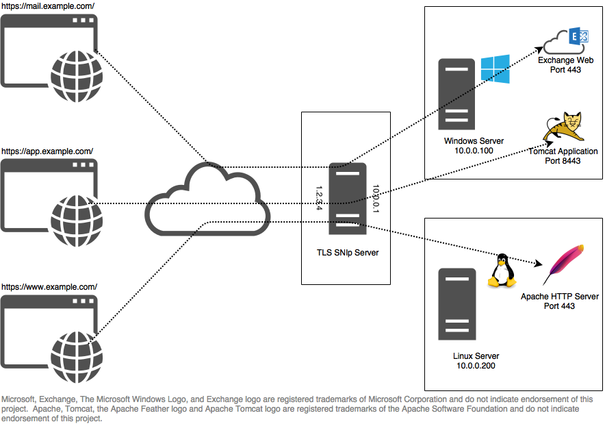

# TLS SNIp - An SNI Based Proxy

## What is TLS?
Transport Layer Security (TLS), known as SSL (Secure Socket Layer) in previous protocol versions, is used to secure 
network communications between two application end-points (generally client and server software).  TLS provides
mechanisms to verify the identity of each endpoint as well as the privacy and integrity of communicated data.  Because 
TLS maintains the semantics of the underlying duplex-stream protocol (TCP in most cases) it is well suited to retro-fit 
existing stream based protocols. For example, Secure HTTP (HTTPS) is the common HTTP Protocol streamed over a TLS
connection.


## What is SNI?
Server Name Indication (SNI) is a TLS extension proposed in RFC 4366 (dated April 2006).  SNI provides for an optional
clear-text indication of the target server's address in the opening phase of communication.  SNI allows TLS servers with 
credentials for multiple identities to select and transmit a client-requested identity instead of blindly providing a 
single identity. As an example, virtual website hosting providers can use an SNI-enabled HTTPS servers to host multiple
secure website certificate identities on the same IP address and port.  Without SNI HTTPS servers can only effectively 
serve one certificate identity per IP address.  In practice this results in wastes IPv4 addresses which have non-trivial
costs and are in short demand. SNI support is commonly enabled in modern web browsers; see below for more details.

## SNI Proxying
In SNI Proxying we use the client's Server Name Indication not to select an identity locally, but instead to select a
target server which can provide that identity.  Once the target has been determined, the proxy server connects and
begins relaying data between the client and target.  The TLS negotiation occurs between the client and target server; 
the proxy relays the handshake and encrypted data, but is not a party to the unencrypted communication.  

## Use Cases

### Mixed Platform HTTPS Hosting
Small and medium businesses are often allocated a single static IPv4 address for on-premise internet connectivity.
TLS SNIp allows these businesses to host multiple HTTPS services on a single IPv4 address.  Communication between 
the client browser and end service application is secured end-to-end.  The end HTTPS applications require no special
configuration and can be hosted on the same server, or traverse the local network.


## Building and Installing TLS SNIp
TLS SNIp uses the cmake build system.  Cmake can generate build projects/scripts for unix make, xcode, and MS Visual
Studio, among others.

### Requirements
- LibEvent 2.1
- LibYAML

## Configuration
TLS SNIp uses 

### Command Line Arguments

### Reloading Configuration
Configurations can be reloaded by signaling HUP.  
```
killall -HUP snip
```

To be safe, you should test the configuration before reloading it.  Loading an invalid configuration can cause the
application to exist with an error. 

```
if ./snip -t -c ../example.yml; then killall -HUP snip; fi
```

If the 'user' configuration value is specified, TLS SNIp drops privileges after it binds to ports during launch. 
Privileges cannot be regained after they have been dropped.  Adding an additional privileged listener and reloading,
will cause a fatal error when SNIp tries to bind the port with its reduced privileges.  

## Todo

- Regex matching / targets
- chrome support
- TLS tests
- configure default routes
- documentation
- more configuration validation
- windows